+++
author = "Yuichi Yazaki"
title = "LT：矢崎 裕一／データ可視化の基本が全部わかる本"
slug = "lt-all-about-dataviz"
date = "2025-10-18"
categories = [
    "meetup","2024"
]
tags = [
    "矢崎裕一"
]
image = "images/cover.png"
+++

Data Visualization Japan Meetup 2024（2024年12月28日開催）における、矢崎 裕一のLTです。

<!--more-->

---



今年ですね「データ可視化の基本が全部わかる本」という本を無事出版することができまして。これについてちょっとご紹介できればなと思っております。

まだ本をご覧になっていない方もいらっしゃるかなと思いまして、目次ですね、目次からその本の構成を紹介します。本の目次って言ったらツリー構造をしているので、ツリー構造で表してみました。

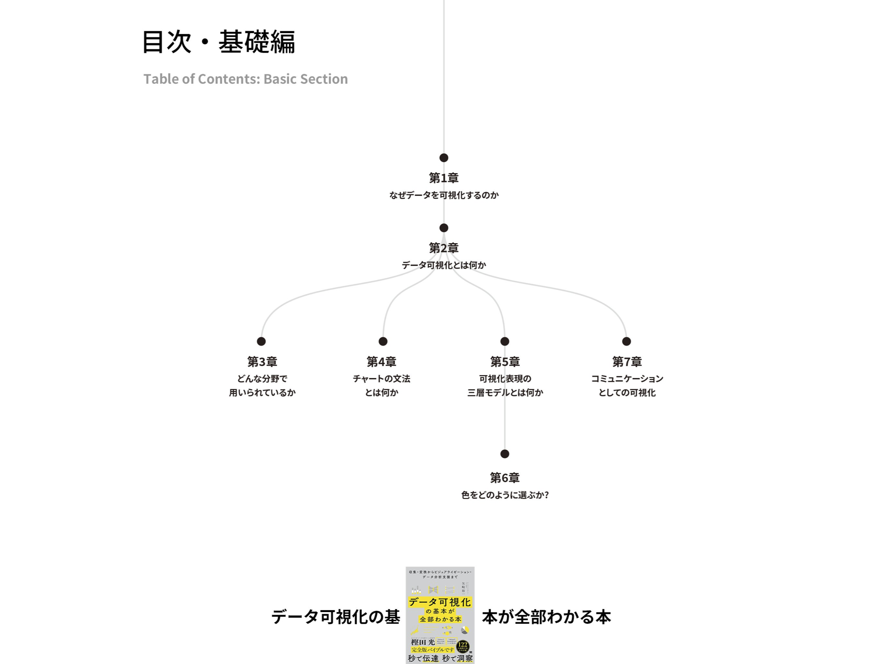

前半が基礎編ということで「なぜ why」というところから入っていって、その後にデータ可視化とは「何か what」というところを、いろんな切り口から述べているというようなものが前半ですね。

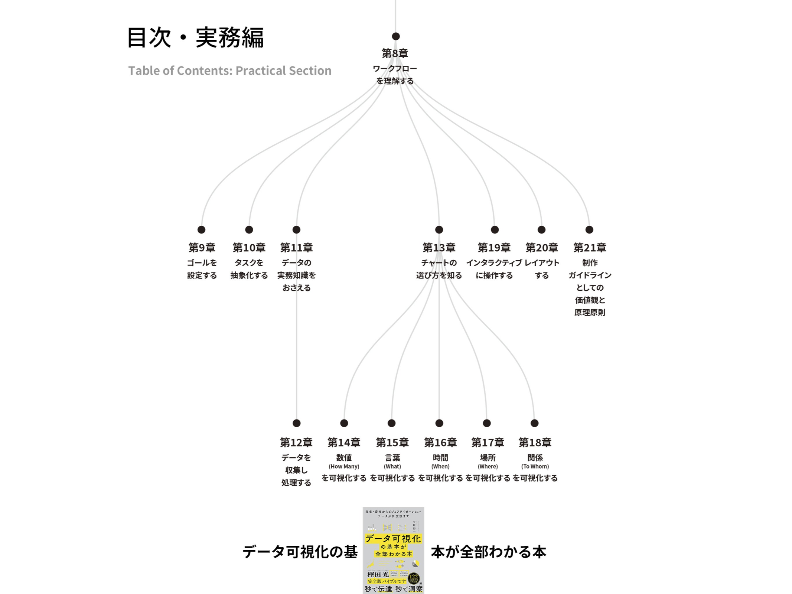

後半の方に行くと実務編というか、実際の作り方 作る手順になぞらえて、いろんな手法とか考え方をご紹介したりとか、 あとはチャートの一覧ですね。カタログという形で紹介をしているというような内容になっております。

あと本買っていただくと付録という形でPDFが取得できるようになってまして、そこでいろんなツールとかですね、あとリンク集なんかもプレゼントしているという形です。

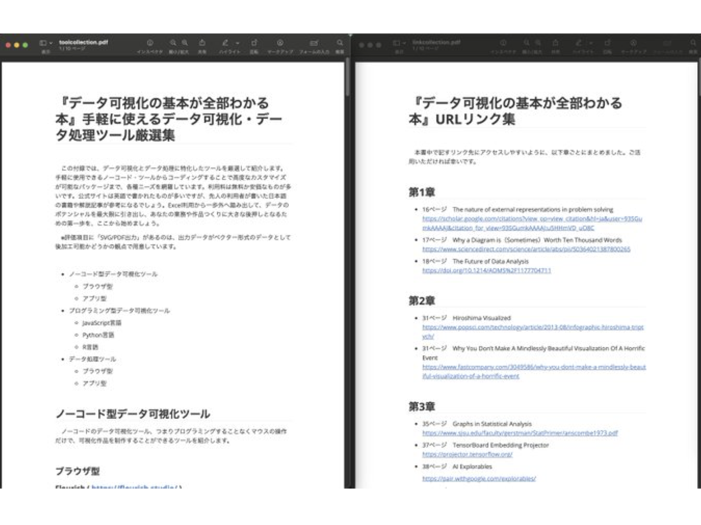

ちょっとこの後にも話出てくるんですけれども、本が少し図とかイラストとか少し少ないっていうご批判もいただくことがあって。それは非常に申し訳ないなと思いつつ、結構URLはこまめに入れてるつもりでして。そこからクリックしていただくと、例えば「YouTubeの動画の色と人間の目のメカニズムについて動画で紹介してますよ」みたいな一文で紹介してるだけなんですけど、実際クリックしていただくとめちゃめちゃわかりやすく説明しているような動画もあったりするので、ぜひリンク先も込みで見ていただけると、嬉しいなと思うところですね。

---

本を書いた理由というかモチベーションみたいなところとして、いくつかあるんですけれども。まずはチャートのそもそもの呼び名とか分類みたいなものが、少し限定的なんじゃないかなという問題意識がありました。で、命名でいうとちょっと即物的なものも 散見されるっていうところが気になっていまして。

円グラフは英語でいうと Pie Chart ですよね。でパイと形が似ているというところとか。

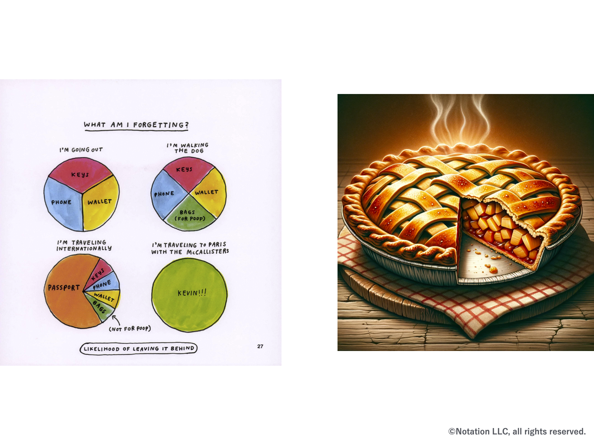

あとは Beeswarm Plotっていうチャートがあったりもしますけれども、これもその言葉をよく追ってみると「蜂が群れてる」という名前のチャートなので、見た目で名前がついているっていうところがあったりして。

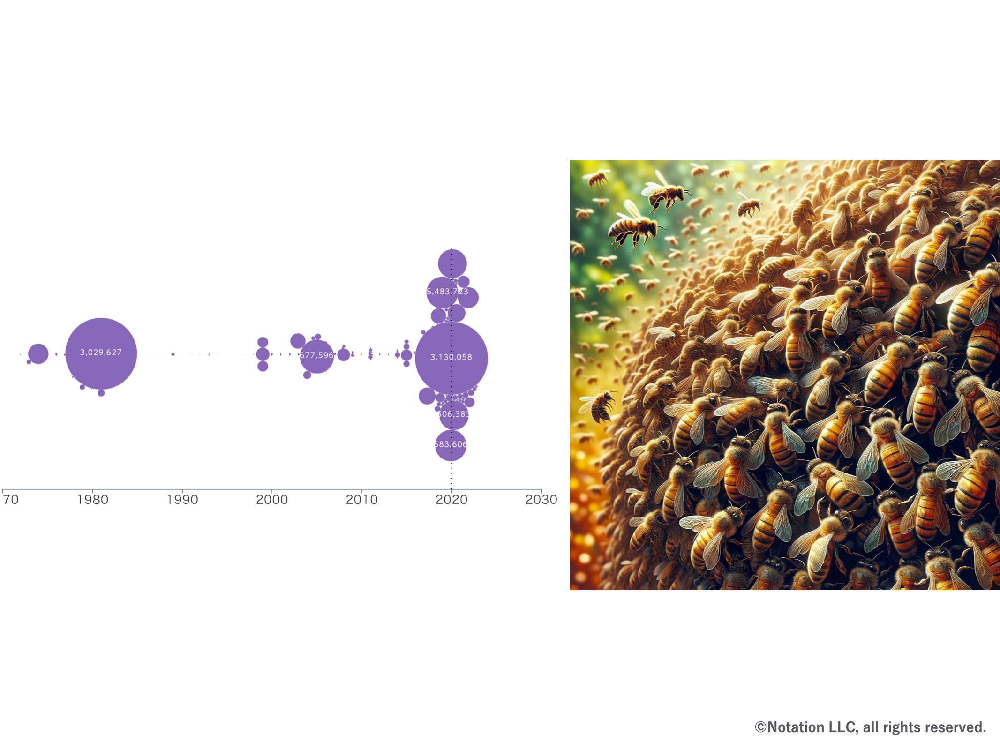

そうするとチャートそのものが持っている機能とか役割とか、そういったものと少し名前の付け方が乖離してるなっていうのが ちょっともやもやっとしたところですね。

---

あとチャートの分類も少し限定的なんじゃないかなっていう感じはして、問題意識として持ってまして。例えば優れたチャートの分類方法っていうのがあって、これらすごく非常に素晴らしいなと思いつつ、これらにですね、これらの一覧で扱っているチャートっていうのが主に数量扱うようなチャートがほとんどだと思うんですが。

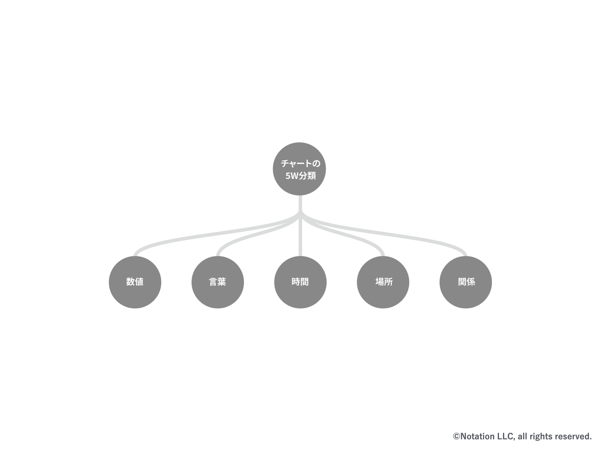

これ以外にもですね「チャートの5W」っていう言い方を本の中ではしてるんですけれども、言葉とか時間とか場所とか関係、関係っていうのはちょっとネットワークとか構造とかを別な言い方をしているものなんですけれども、っていうところも全部ひっくるめて、体系的に理解できるといいんじゃないかなというふうに 思ったところなんですよね。

で、チャートに関してもこんな感じで 一覧にして整理をしていきまして。いろんな呼び方・諸説あるかもしれないんですけれども 一応これ呼ぼうよっていうような感じのことを、そういう意図を込めてですね、名前とチャートとセットで紹介しているという感じなんですよね。これ自体はオリジナルというよりかは5Wでみたいなところで言うと K.T.ボーナーさんっていう海外の研究者の方が同様にまとめられていて、それに非常に共感してっていうところですね。ただ一つ一つのまとめ方自体は自分で検討しまして、整理をしているというものですね。ちょっと細かいですけど、場所なんかは既存の研究者の方の整理の仕方をそのまま使ったほうがいいかなと思って、自分の分類を差し置いて、参考にしたりはしてます。という感じが一つ。

---

あとチャートの構造というか作られ方も分かりづらいんじゃないかなというもやもやポイントも持っていまして。

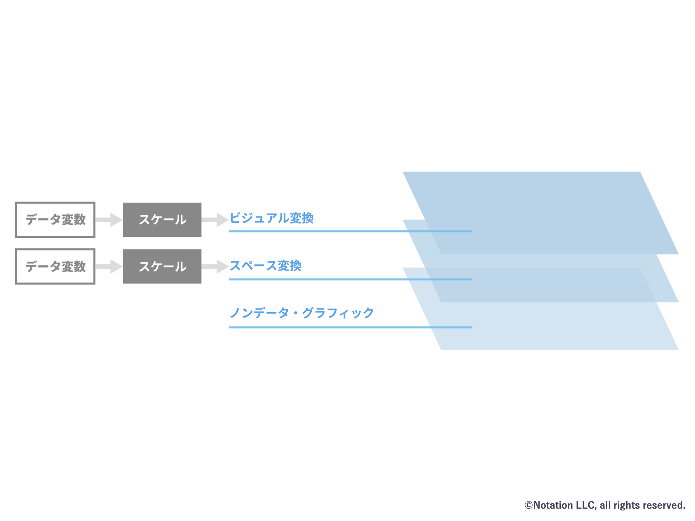

これはどちらかというとコンピューターサイエンス的な観点から言うと、チャートってアニメーションってセル画で、前傾の登場人物と、背景つまり登場人物たちがいる場所とか時間帯とか、そういったものを描くですね、透明なセル画とかコンピューターでいうところのレイヤーですね。これに描いてそれらが重なって一つの絵になると思います。それと同じようにチャートの構造も理解した方がいいんじゃないかっていうのが一つですね 。

それの元ネタはリランド・ウィリキンストンさんっていう方の The Grammar of Graphics っていう本ですね 彼が昔の80年代ぐらいの統計のソフトウェアのチャートの部分を実装する中で そこでの理論をまとめたものなんですよね。なんですけども、この本自体が600ページぐらいある英語の本で、結構オブジェクトの思考の話が延々続いたりとか。あとはレイヤー分けされてるんですけど、結構レイヤーの数が多かったりとかして。このレイヤーっていう概念で理解するのは可視化の部分のみでいいんじゃないかなと。一般教養としてはですね。そのデータをどう扱うかみたいなところとか、そういったところはこのレイヤー構造として理解しなくてもいいんじゃないかっていうところで、間引いて間引いて間引いてっていう形で、この2層とか3層っていう形に 一般的なこの理解で十分なんじゃないかっていうのでまとめたということですね。

プラスでこの本自体は現代のですね、いろんなコンピューター上でデータ処理するってことは、現代では当たり前だと思うんですけども。その中でのデータの分析とか。あとはウェブのフロントエンドをですね、ブラウザーで描画するとか そういった時の可視化のパッケージも実は 今のグラムアブグラフィックスの考え方で実装されていたりするので、一般教養として理解するという理解の仕方としてもふさわしいし、実際にコンピューターを使ってチャートを描画していこうという時にも、その考え方でソフトウェア自体が実装されていたりするので、そうすると理にかなるんじゃないかなというのが願っているところですね。

---

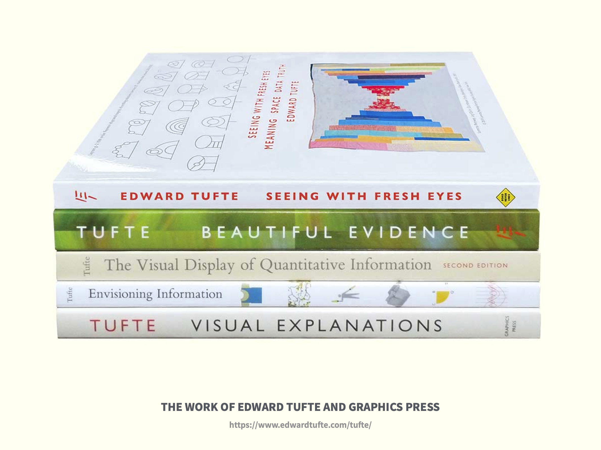

別な問題意識としてはデータインク比という言葉があると思うんですよね。これってエドワード・タフテさんという海外でいうとデータ可視化系の教科書として長らく扱われている著者の方がいらっしゃると思うんですけども。彼のいくつか主張している中の一つがデータインク比ですよね。データインク比っていうのが 当時はウェブがなかったので、印刷にインクを使う。データを表現するのにインクを使うと。その時に極力インクを無駄にしないっていうことが、一つのいいチャートを描くための方向性なんじゃないかということで、データも極力インクの使う量を少なくしますし、データ以外のものは描かない方がいいと。ただこの考え方を突き詰めていくと、例えば左のような箱ひげ図が右のようなバージョンになるわけですね。これで果たして読解はできるかもしれないけども、そもそも好んで見てもらえるかどうかとかいう問題もあるような気もしまして、このデータインク比っていうところだけに固執してしまうっていうのも、あんまり良くないんじゃないかなという感じもしてるんですよね 

ただこの本自体が 著者の方がすごくこだわって、自分で出版社とか作って、本の装丁とか紙を選んだりとかいう形で作っているので。そうすると電子書籍がなかったりとか、翻訳版がなかったりもするんですよね。そうするとこの中身がなかなか日本語圏で、自分一人が読むことができても、共通の知識としてこれを前提として話をするっていうのは、なかなか難しいっていう話。あと、実物がないままデータインク比っていう言葉だけが 一人歩きしてしまうのもちょっと危ういんじゃないかなっていう感じもしたりしてるところですね。

これに関しては面白い研究があって、今のタフテさんのやり方ともう一方ですね、ナイジェル・ホームズさんっていう方がいて。彼は少しイラストベースな作品を作る方なんですよね。

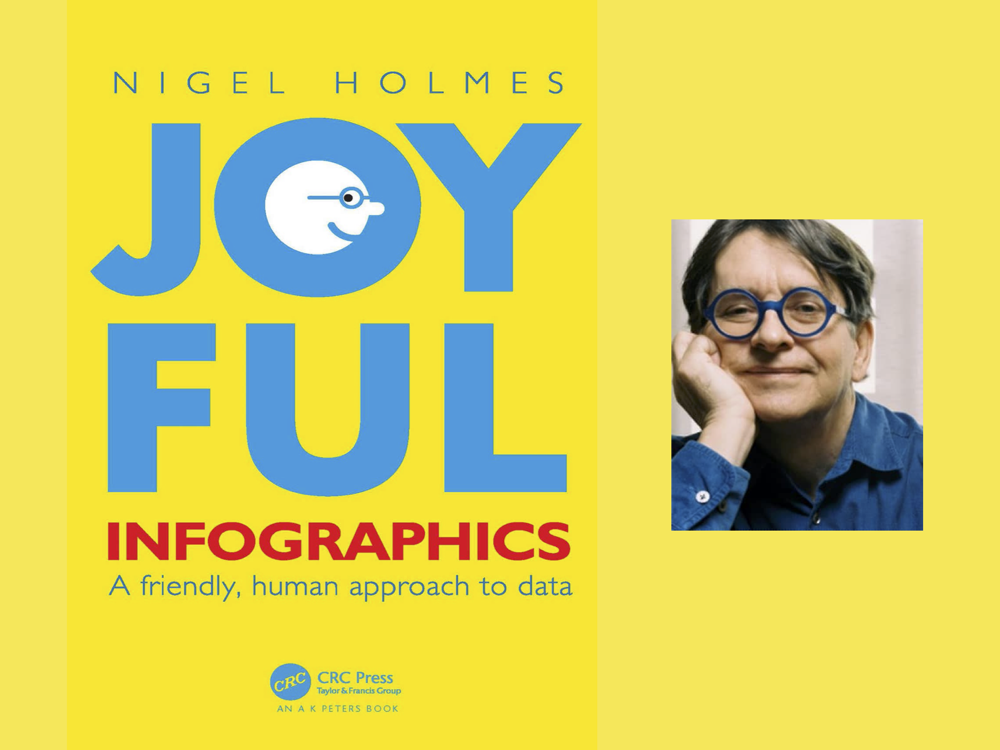

このお二人の作品を比較してですね 被験者の人にチャートの理解と記憶ですね、これでどっちが優れていたのかっていう調査を行ったわけですね。これについてはちょっと片っぽ見づらいかもしれないんですけれども。右上に凡例があって、ホームズさんがイラスト版の方ですね。簡易版って書いてある方がエドワード・タフテさん。データインク比を普及しようとしていた方ですね。比べるとこの結果だけ取り上げてもアレなんですけれども、ホームズさんの方が端的に言うといい結果出たっていうところはあるといえばあるんですよね。

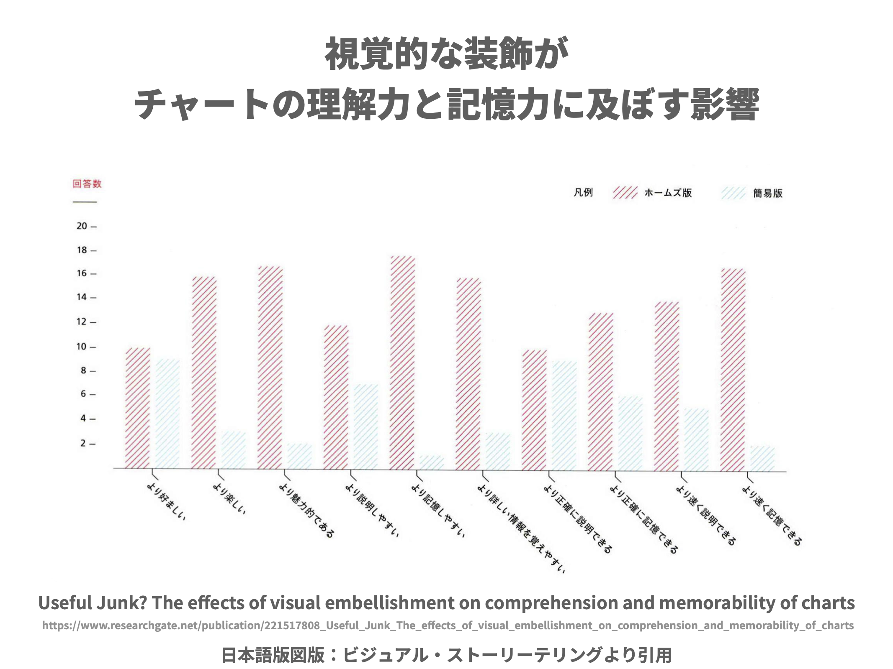

ただちょっとコミカルすぎたり、データがこれで果たして 左上のキャラクターで、歯の長さで果たして正確にそもそも表現できてないような気もするので、ちょっと全面的にってわけではないんですけども。ただデータインク比だけ大事にするっていう方向性もちょっと違うんじゃないかなっていう感じもしてますと。その時にやっぱり大事なのってバランスなんじゃないかなっていう気はしてまして。

---

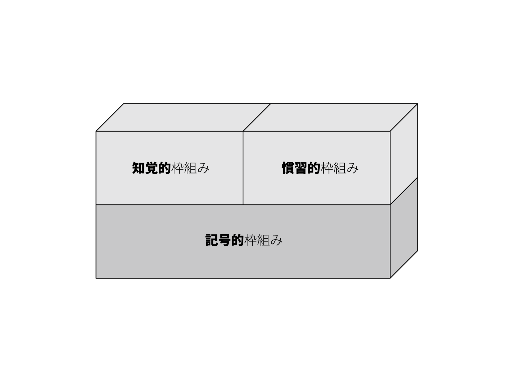

データを幾何図形を使って表現するっていうこと自体は、例えば数式とか言葉と比べても、すごく優れた変換のルールだと思うんですけれども。その上に知覚的な枠組みと慣習的な枠組みって分けてあげたらいいんじゃないかなというところですね。

知覚的なっていうのは人間の知覚的な根拠があって学習が不要でスッと入ってくるようなもの。

もう一つは文化的な積み重ねによって、解釈のされ方みたいなものを、うまく引き出すような表現の仕方ということですね。

分けてあげた方がちゃんと評価できるんじゃないかなというふうに。ここ渾然一体になっちゃうと、その作品自体を適切に評価するっていうのが難しいんじゃないかなというふうに思ったところなんですよね。なのでこの辺の整理も提示したいと。

---

あとデータから価値を作るっていう方法が データサイエンスが全てでもないんじゃないかっていうのは、ちょっとポジショントーク的な感じですけれども。

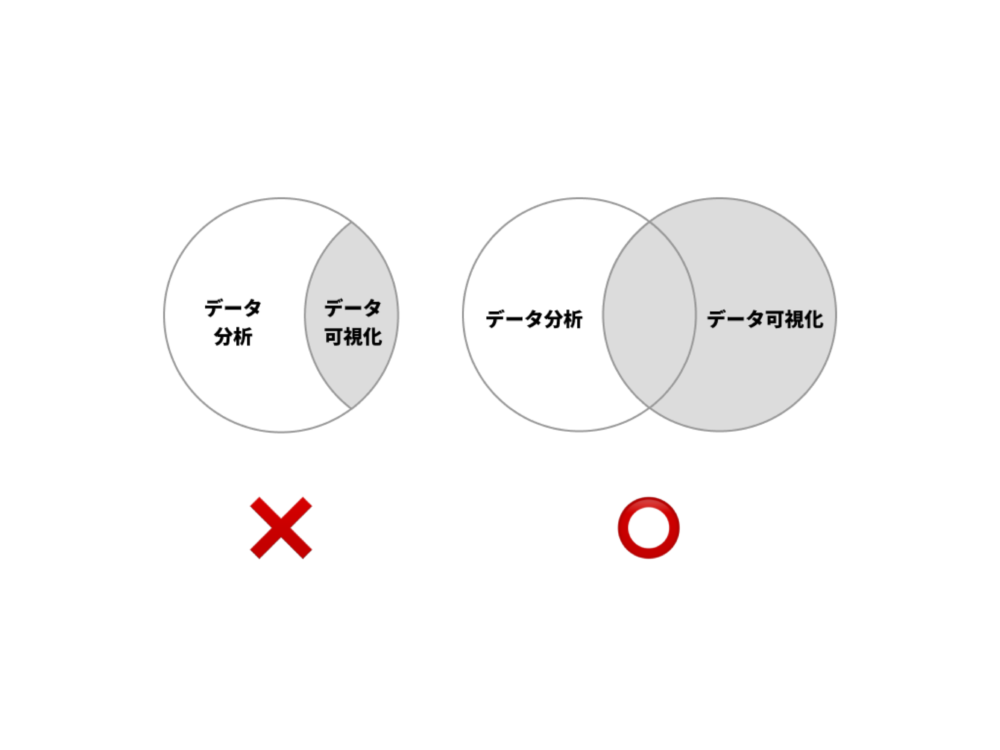

世間一般的な理解としてもしかしたらデータ分析があって、そこの中の分析の結果とかプレゼンテーションっていうところにデータの可視化があるっていうイメージだとしたら、そうではなくて独立したですね、もう一つ別な分野としてデータの可視化・情報可視化と呼ばれるものがあって、重なっている部分もあるし、重なっていない部分もあるよねということを言いたいなというところでした。というのもやっぱりデータの可視化だけでも歴史的な積み重ねがあって 今に至っているというところがありますので。

ただこれらがなかなか日本語で翻訳されていなかったりするという現状もある中で、過去のいろんなこういった積み重ねをですね、日本語で活用すると。過去にいろいろ行われてきた知見をそのまま眠っているのはもったいないので、なんとか現在で活用できる形にできないかというのが問題意識としてあったというところですね。

---

評判とかレビューとかっていうところで言うと、一応発売されて第1週目はベスト5に入ることができたんですが、そこからやっぱりね 大量に出版されてるので なかなかですね。そこから5位以上に上がるっていうのはもうないですね、っていう感じでした。で、帯描いていただいたのは樫田光さんという方で、彼は元々メルカリでデータ分析の責任者をやっていた方で、現在ではデジタル庁でですね、チーフアナリティクスオフィサーということで、分析の責任者ですね、やってらっしゃる方ですね。 書いていただけてすごくありがたかったですね。他にも素敵なレビューいただいて、ちょっと時間がないと思うのでスキップしていきますが。Amazonのレビューを見ると結構ですね、高く評価していただいている方と、ちょっとそうでもないというところと 2つに割れていまして。今日何発表しようかなと思った時に、低評価のレビューと高評価のレビューでテキスト分析して並べようかなとか、そういうのを一瞬頭をよぎったりもしたんですけれども。ちょっとそうですね、切ない言葉も並んでいたりするので ちょっとそこは日和りましたね。「買わないで図書館で読んでおくぐらいにしておいてよかった」みたいな感じのことを書かれていたりとかして、いやーちょっとなかなかね、悲しいものがありますね。

一応、僕としてはそのなんかカルピスとカルピス・ウォーターって違うじゃないですか。僕としてはカルピスを作ったつもりなんですよね。そうすると自分で好きなように割ってください、と。ソーダ水で割ってもいいし、オレンジジュースで割ってもいいし、いろんな飲み方してもいいですよねっていうのを一応意図したつもりなんですけれども。でもこれをそのまま薄めずに原液のまま飲んで「飲めない、まずい」というのがミスマッチの大きな理由なのかなというふうに思ったりするところです 

---

一応そういう方向けってわけでもないんですけども、個人でも講習っていう形で、本だと割と原理原則の話が多いんですけれども、そこをもうちょっと噛み砕いて、いろんな実例とか具体例をベースに話をしているレクチャーをさせていただいているというような場も。これも定期的にやっているという感じですね。

---

そんなにもう残り時間ないと思うので、 今後挑戦したいことっていうところで言うと、まだ数冊本は出せないかなというふうに思ってまして。もともと私はバックグラウンドはデザイナーなので、インフォグラフィックスの作り方とか、あとは提供価値ですね。やっぱりインフォグラフィックスも表現寄りの作品の評価の仕方がやっぱり主流のような気はしてるんですけれども、きちんと「社会の中で価値を提供できる」インフォグラフィックスならではの価値を、ビジネスシーンも含めて提供できる価値があると思うんですよね。なのでこれをちょっと明らかにしていきたいなという風に思っているところです。

---

ちょっと駆け足になってしまいましたが、発表としては以上です。本屋さんでもし見かけていただいたらですね、ちょっと手に取っていただけると非常に嬉しいです。以上です。どうもありがとうございました。